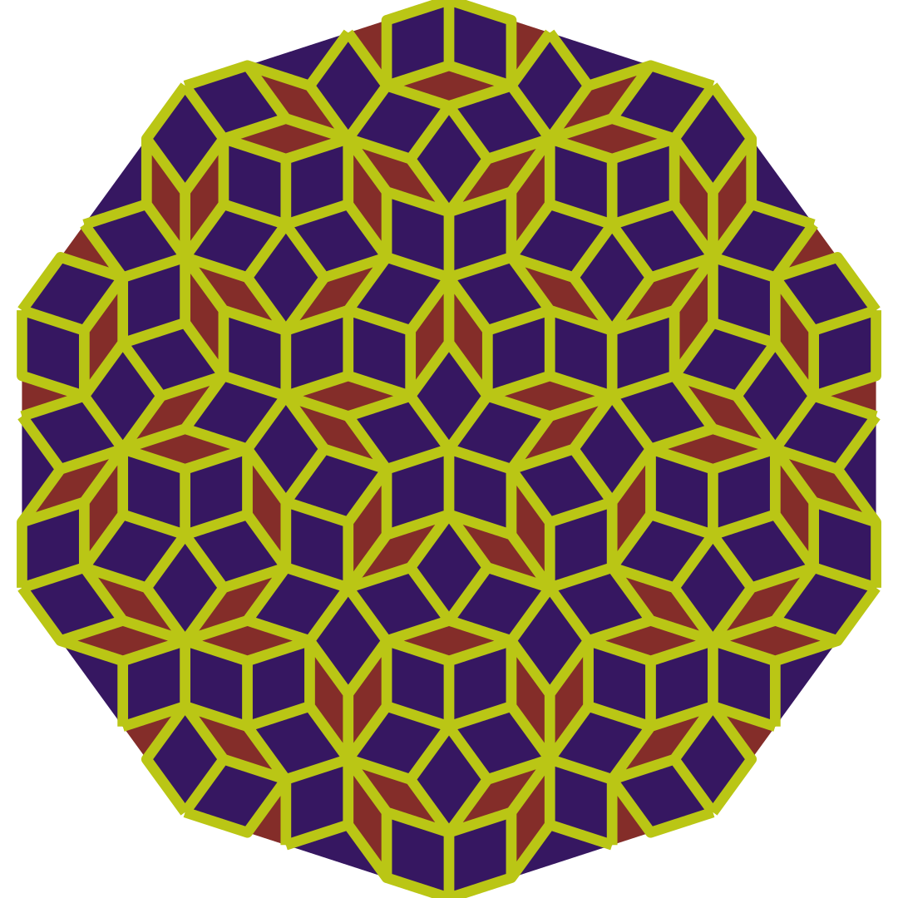
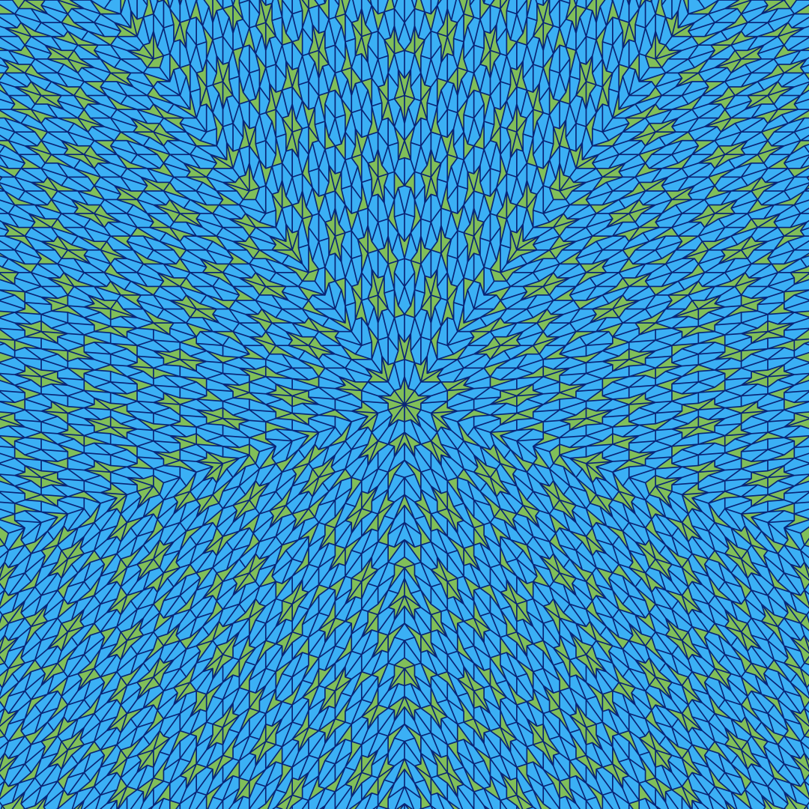
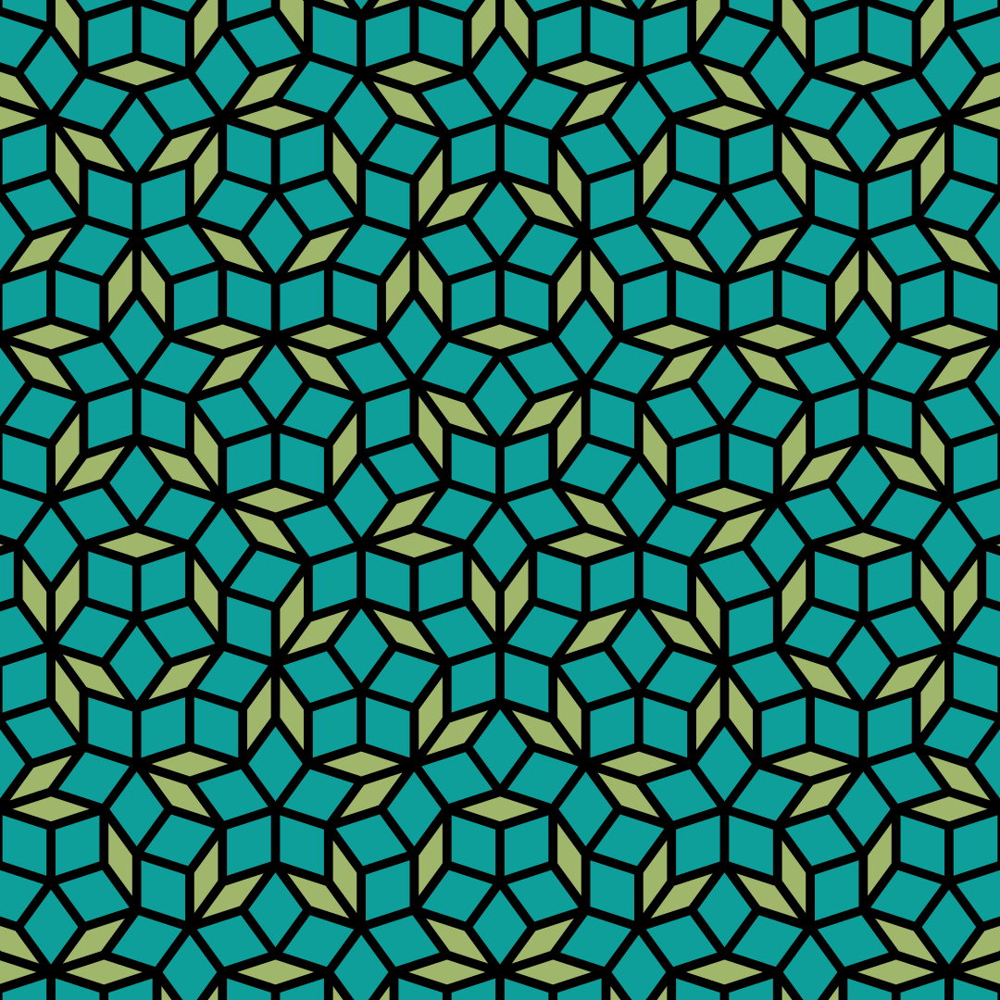
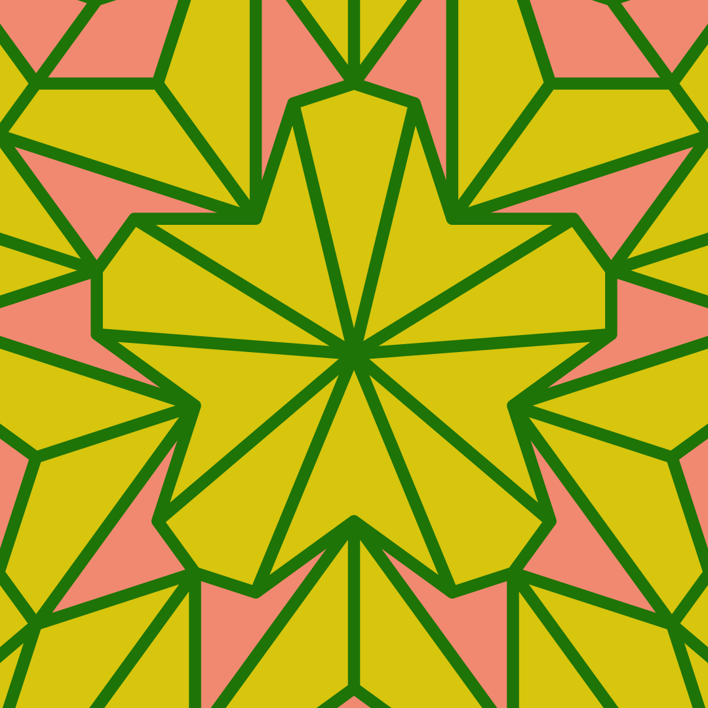
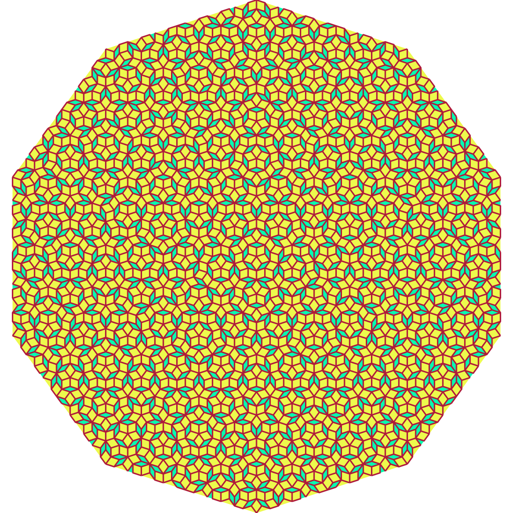

## Penrose tiling

Fun little coding side project, was inspired by this [Veritasium video](https://www.youtube.com/watch?v=48sCx-wBs34) so decided to implement it

Penrose.py makes a penrose tiling pattern using rhombi and kind of trapezium like shapes 

Penrose-kites.py makes a penrose tiling pattern using kites and darts, but doesn't quite work as I'd like it to 

Current supported colours:
- Red
- Green
- Blue
- White
- Black
- Yellow
- Cyan
- Magenta
- Orange
- Purple
- Pink
- Brown
- Gray
- Random

### Basic rundown of algo
- Get user options
- Create 10 triangles to form a circle ish
- Split each triangle so that the ratio between the edge of the new vertex and distance between other vertices on the same edge satisfy the golden ratio
- Draw the triangles and outline them so that the corresponding rhombi are highlighted
- Export to cairo surface to png 

For more on algorithm and great explanation for penrose tiling this [article was great](https://preshing.com/20110831/penrose-tiling-explained/)

#### More pretty pictures

